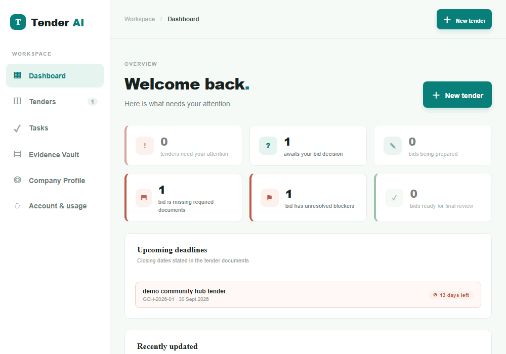
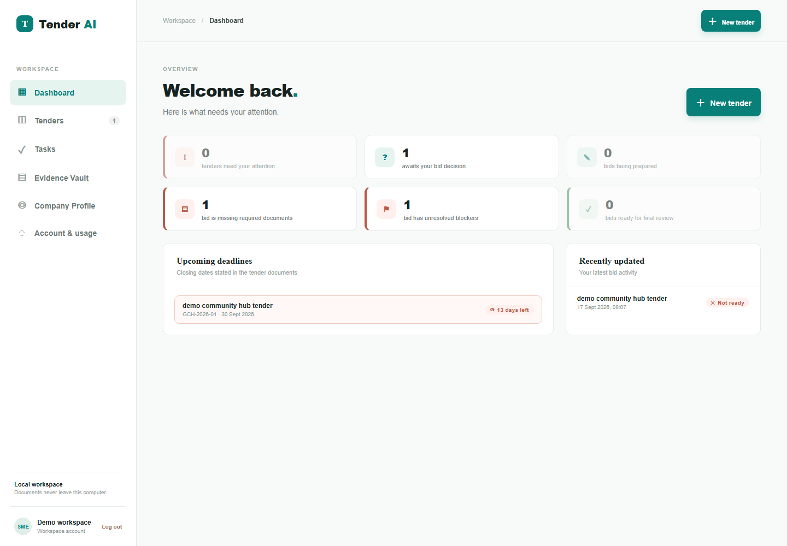
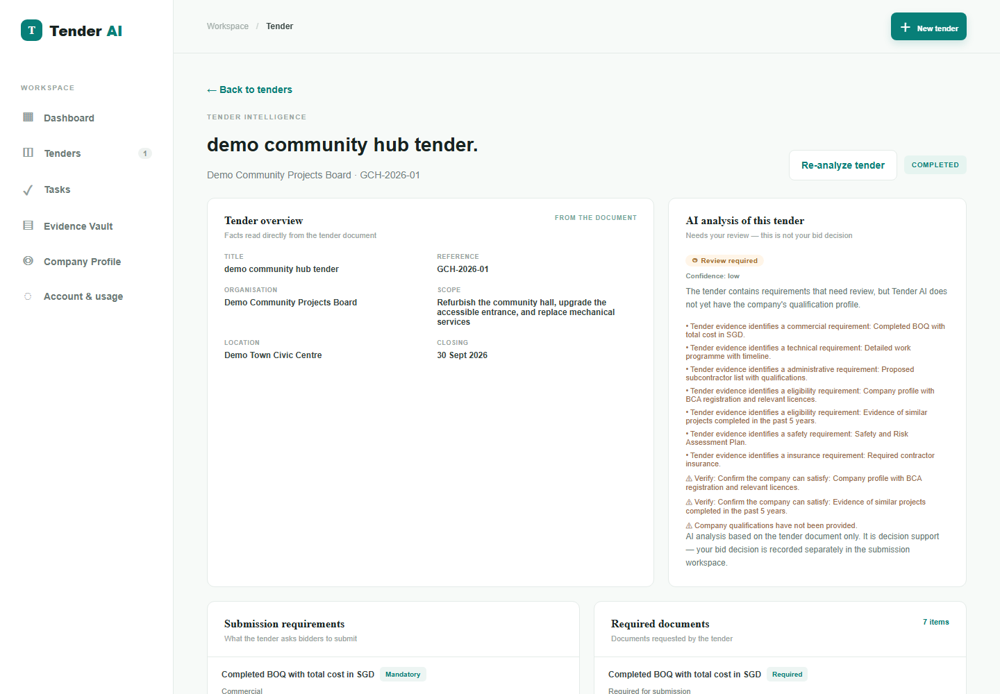
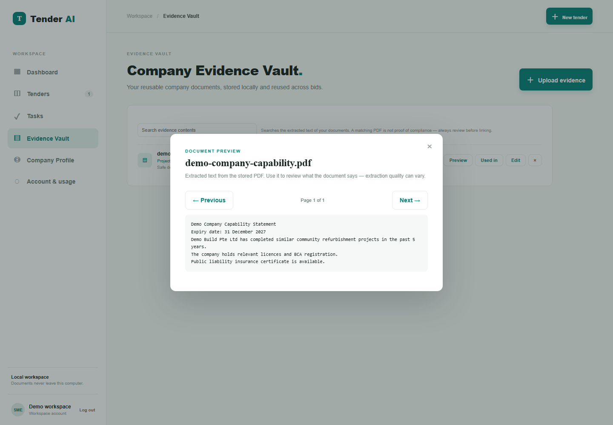
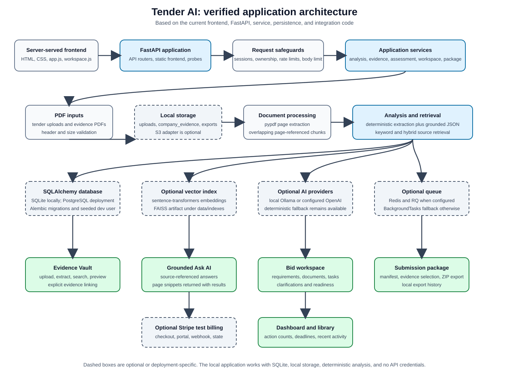

# Tender AI

Tender AI is a source-aware tender intelligence and bid-preparation workspace for small and medium-sized businesses. It turns tender PDFs into structured, page-referenced information and helps teams decide whether to bid, prepare supporting evidence, and assemble a submission package.

The project demonstrates an end-to-end application architecture: FastAPI backend, server-served frontend, PostgreSQL or SQLite storage, optional vector embeddings, local or hosted AI providers, optional Redis/RQ jobs, S3-compatible object storage, authentication, usage limits, and Stripe test billing.

AI-generated analysis is decision support, not legal, procurement, or compliance advice. Users should review the extracted sources before making a submission decision.



_Demo of the tender analysis to evidence/results workflow using safe demo data._

## Product Screenshots

The screenshots below were captured from the live local application using safe, temporary demo PDFs. No private or user documents are included.



_Dashboard overview with tender actions, deadlines, and recent activity._



_Source-aware tender analysis with extracted overview, AI assessment, requirements, and document details._



_Evidence Vault with extracted-text preview for a safe demo company document._

## What It Does

- Extracts text from uploaded tender PDFs and preserves page references.
- Identifies dates, requirements, risks, clarifications, and checklist items.
- Supports grounded questions about an analyzed tender with source pages.
- Maintains a company profile and an evidence vault for supporting PDFs.
- Suggests potentially relevant company evidence for tender requirements.
- Tracks bid decisions, clarification actions, document readiness, and blockers.
- Builds a submission-package manifest and ZIP export.
- Provides user accounts, isolated workspaces, ownership checks, and usage limits.
- Includes optional Ollama or OpenAI analysis, Redis/RQ processing, and Stripe test billing.

## Target Users

Tender AI is intended for SME owners, bid managers, proposal writers, and operations teams that review public tenders and need a structured workspace for evidence and submission preparation. It is also useful as a portfolio example of a production-oriented document-AI application.

## Key Features

### Tender analysis

- Accepts PDF uploads up to the configured 25 MB limit.
- Validates the PDF header and stores uploaded files under generated names.
- Extracts page-level text with `pypdf`.
- Splits text into overlapping chunks while retaining page identity.
- Persists structured analysis and source snippets for review.
- Provides deterministic analysis even when optional AI dependencies are unavailable.

### Grounded question answering

- Searches sources associated with a completed tender analysis.
- Returns an answer with matching source pages and snippets.
- Uses page-referenced retrieval rather than presenting unsupported claims.

### Company evidence and bid preparation

- Stores company evidence PDFs with categories, descriptions, page counts, and optional expiry dates.
- Extracts and chunks evidence while retaining page references.
- Provides conservative, potentially relevant evidence suggestions; users must review and link evidence explicitly.
- Tracks tender requirements, requested documents, clarifications, notes, decisions, and readiness states.
- Exports a ZIP containing a submission manifest and selected evidence documents.

### Platform capabilities

- FastAPI API with a server-served HTML/CSS/JavaScript frontend.
- SQLite for local development and PostgreSQL for configured deployments.
- Alembic schema migrations.
- Local filesystem storage by default and an S3-compatible storage adapter for deployments.
- Server-side sessions, password hashing with scrypt, workspace ownership checks, and configurable authentication.
- Monthly tender and AI-question usage limits.
- Stripe checkout, billing state, customer portal, cancellation, and signed webhook handling for test-mode billing.
- Request IDs, structured JSON logging, application-level rate limiting, and an ASGI request-body limit.
- Optional Redis/RQ analysis jobs with an in-process FastAPI `BackgroundTasks` fallback.

## How It Works

```text
Tender PDF
  -> validate and store with a generated filename
  -> extract page text
  -> split into overlapping, page-referenced chunks
  -> optionally generate embeddings and a FAISS artifact
  -> run deterministic analysis or an Ollama/OpenAI provider
  -> validate grounded results against extracted sources
  -> persist analysis, sources, requirements, dates, risks, and clarifications
  -> expose the results through the API and bid-preparation workspace
```

The optional embedding path uses `sentence-transformers` and can write a FAISS index. The current question-retrieval path remains source-based and combines keyword and hybrid term scoring, so the optional vector artifact should not be treated as the only retrieval mechanism.

If Redis is configured, analysis can run through RQ. Otherwise, the API uses FastAPI background tasks, which are suitable for local development but are process-local.

## Architecture



_The diagram follows the current codebase. Dashed components are optional or deployment-specific; the local development path uses SQLite, local storage, deterministic analysis, and no API credentials._

## AI Provider Configuration

`AI_PROVIDER=ollama` is the local default. The default Ollama model is `qwen2.5:7b`, configured through `OLLAMA_URL` and `OLLAMA_MODEL`.

`AI_PROVIDER=openai` enables the optional OpenAI provider using `OPENAI_API_KEY` and `OPENAI_MODEL`. In production, OpenAI mode requires an API key. Unknown or unavailable providers return no LLM result, allowing the deterministic local analysis path to continue.

The repository does not include cloud API credentials. When a hosted provider is enabled, the selected evidence is sent to that provider, so its data-handling terms should be reviewed.

## Technology Stack

| Area | Technology |
|---|---|
| Backend | Python, FastAPI, Uvicorn |
| Data access | SQLAlchemy 2, Alembic |
| Databases | SQLite for local development; PostgreSQL via psycopg for configured deployments |
| Frontend | Server-served HTML, CSS, and JavaScript; no build step |
| PDF processing | pypdf |
| Optional embeddings | sentence-transformers, NumPy, FAISS |
| AI providers | Ollama and OpenAI |
| Background processing | FastAPI BackgroundTasks; optional Redis and RQ |
| Storage | Local filesystem or S3-compatible object storage through boto3 |
| Authentication and billing | scrypt password hashing, server-side sessions, Stripe SDK |
| Observability and protection | Structured logging, request IDs, rate limiting, body-size middleware, security headers |

## Project Structure

```text
backend/
  app/                 FastAPI application, models, services, and configuration
frontend/
  index.html           Application shell
  app.js               Dashboard, tender, account, and billing UI
  workspace.js         Bid workspace and evidence-linking UI
  styles.css           Frontend styling
docs/
  tender-ai-architecture.svg
  images/
    dashboard.png
    tender-analysis.png
    evidence-results.png
alembic/
  versions/            Database migrations
tests/                 API, service, security, billing, and workflow tests
.env.example           Environment-variable template; never commit real values
ARCHITECTURE.md        Detailed architecture notes
PHASE15_AUDIT.md       Production-readiness audit and implementation history
```

## Running Locally

### Prerequisites

- Python 3.11 or newer (the Dockerfile uses Python 3.12).
- Git.
- Ollama if you want local LLM analysis.
- Redis only if you want to exercise the RQ worker path.
- PostgreSQL, S3-compatible storage, and Stripe test credentials only for deployment-style testing.

### 1. Create a virtual environment

```bash
python -m venv .venv
```

Activate it with the command appropriate for your shell, for example:

```powershell
.\.venv\Scripts\Activate.ps1
```

### 2. Install dependencies

```bash
python -m pip install --upgrade pip
python -m pip install -r requirements.txt
```

For optional sentence-transformer and FAISS support:

```bash
python -m pip install -r requirements-ai.txt
```

### 3. Configure the application

Copy the example environment file and replace placeholder values:

```powershell
Copy-Item .env.example .env
```

For a basic local run, keep SQLite and set `AUTH_REQUIRED=false`. Use a strong, private `AUTH_SECRET` rather than the example placeholder. Set `AI_PROVIDER=ollama` if Ollama is installed.

Install Ollama, start it, and pull the configured model:

```bash
ollama pull qwen2.5:7b
```

### 4. Apply database migrations

```bash
alembic upgrade head
```

The application also runs its migration initializer at startup for local convenience.

### 5. Start the API and frontend

```bash
python -m uvicorn backend.app.main:app --reload --host 127.0.0.1 --port 8000
```

Open `http://127.0.0.1:8000` in a browser.

### Optional: run an RQ worker

Start Redis, set `REDIS_URL=redis://127.0.0.1:6379/0`, then run:

```powershell
.\.venv\Scripts\rq.exe worker tender-ai --url redis://127.0.0.1:6379/0
```

If Redis is unavailable, analysis falls back to FastAPI background tasks.

### Optional: configure Stripe test billing

Set the Stripe test secret key, test Price IDs, webhook secret, and redirect URLs in the environment. Do not commit those values. The implementation is intended for test-mode billing; live billing requires deployment-specific configuration and review.

## Environment Variables

The most important settings are:

| Variable | Purpose |
|---|---|
| `DATABASE_URL` | SQLite or PostgreSQL connection URL |
| `AUTH_SECRET` | Signs session-token hashes; required for production |
| `AUTH_REQUIRED` | Enables authentication for API access |
| `AI_PROVIDER` | Selects `ollama` or `openai` |
| `OPENAI_API_KEY` | Required only for OpenAI provider mode |
| `OPENAI_MODEL` | OpenAI model name |
| `OLLAMA_URL`, `OLLAMA_MODEL` | Local or configured Ollama endpoint and model |
| `REDIS_URL` | Optional Redis connection for durable RQ jobs |
| `EMBEDDING_MODEL` | Sentence-transformer model used by the optional embedding path |
| `STORAGE_BACKEND` | Selects `local` or `s3` |
| `S3_BUCKET`, `S3_ENDPOINT_URL`, `S3_REGION` | S3-compatible storage configuration |
| `S3_ACCESS_KEY_ID`, `S3_SECRET_ACCESS_KEY` | S3 credentials; keep private |
| `STRIPE_SECRET_KEY`, `STRIPE_WEBHOOK_SECRET` | Stripe test or deployment credentials |
| `STRIPE_PRICE_*` | Internal plan-to-Stripe Price ID mapping |
| `UPLOAD_DIR`, `COMPANY_EVIDENCE_DIR`, `EXPORT_DIR`, `INDEX_DIR` | Local data locations |
| `ALLOWED_ORIGINS`, `ALLOWED_HOSTS` | Production CORS and trusted-host configuration |
| `MAX_UPLOAD_SIZE_MB` | Request-body and PDF upload limit |
| `RATE_LIMIT_ENABLED` | Enables application-level rate limiting |

See `.env.example` for the complete template. Never commit `.env` or real credentials.

## Database and Migrations

Local development uses SQLite by default. Production deployments can use a PostgreSQL URL such as a `postgresql+psycopg://...` connection. Schema changes are managed with Alembic:

```bash
alembic revision --autogenerate -m "describe the schema change"
alembic upgrade head
```

The startup initializer also handles a fresh database or stamps a compatible legacy local database at the current revision.

## Testing

Run the test suite from the project root:

```bash
pytest -q
```

For lightweight frontend syntax checks:

```bash
node --check frontend/app.js
node --check frontend/workspace.js
```

The tests use isolated temporary databases and storage directories. Do not use real Stripe credentials, cloud credentials, or private documents in test commands.

## Security and Privacy

- Uploaded filenames are replaced with generated names and storage paths reject traversal.
- PDF uploads are checked for a PDF header and the configured size limit.
- API routes enforce workspace ownership for tender, evidence, bid, and package resources.
- Passwords are hashed with scrypt and a per-user salt.
- Sessions are stored server-side; cookies are HttpOnly and SameSite=Lax, with Secure enabled in production.
- Production configuration rejects unsafe authentication and host settings.
- Request IDs, structured logs, rate limiting, body-size enforcement, security headers, and Stripe webhook signature verification are included.
- Local storage keeps files on the configured filesystem; S3 storage sends files to the configured bucket.
- Ollama inference is local when `OLLAMA_URL` points to a local endpoint. OpenAI mode sends selected evidence to OpenAI and is not a fully local-processing configuration.

## Limitations

- Scanned or image-only PDFs may not contain enough extractable text and are not handled by an OCR pipeline.
- The deterministic fallback is less capable than a configured LLM.
- Embeddings and FAISS are optional; the current question-retrieval path is source-based hybrid/keyword scoring.
- RQ provides durable processing only when Redis and a worker are configured; the fallback is process-local.
- The application-level rate limiter is in-process and is enforced per worker in a multi-worker deployment.
- Team invitations, email verification, password reset, and production deployment validation are not included.
- AI output and readiness states require human review and are not a compliance determination.

## Further Documentation

See `ARCHITECTURE.md` for detailed service boundaries and deployment notes. See `PHASE15_AUDIT.md` for the production-readiness audit and implementation history.
